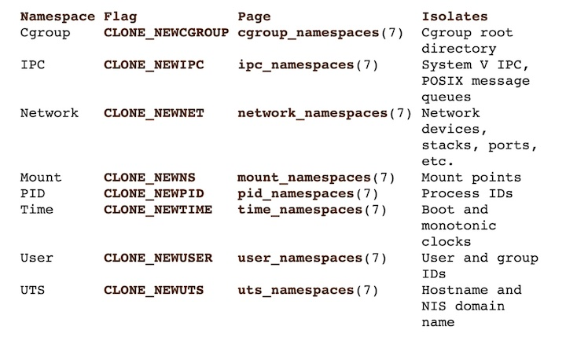
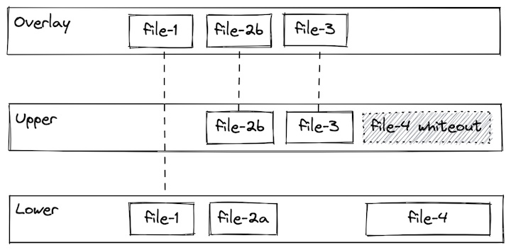

# Fundamentos de docker 

# Qué es Docker y por qué se utiliza?

Docker es una plataforma de software que permite a los desarrolladores empaquetar, distribuir y ejecutar aplicaciones dentro de contenedores. Un contenedor es una unidad estándar de software que incluye todo lo necesario para que una aplicación se ejecute de manera independiente, incluidas bibliotecas, dependencias y configuraciones.

La principal razón por la que se utiliza Docker es la portabilidad y la consistencia del entorno de desarrollo y despliegue. Al encapsular una aplicación y todas sus dependencias en un contenedor, se garantiza que se ejecutará de la misma manera en cualquier entorno, ya sea en una máquina de desarrollo, en un servidor de producción o en la nube. Esto elimina los problemas de "funciona en mi máquina" y simplifica el proceso de despliegue.


Otras ventajas:

  - Escalabilidad y uso de recursos 
  - Facilidad de colaboración 
  - Facilitar la adopción de usar el cloud
  - Agilizar el desarrollo y proceso de despliegue
  - Velocidad y eficiencia
  - Aislamiento y seguridad
 

---
- [Historia de la virtualizacion](#history-of-virtualization)
    - [Bare Metal](#bare-metal)
    - [Virtual Machines](#virtual-machines)
    - [Containers](#containers)
   

## Historia de la virtualización
### Bare Metal
Antes de que se inventara la virtualización, todos los programas se ejecutaban directamente en el sistema host. La terminología que mucha gente usa para esto es "bare metal". Si bien eso suena elegante y aterrador, es casi seguro que está familiarizado con la ejecución en bare metal porque eso es lo que hace cada vez que instala un programa en su computadora portátil / computadora de escritorio.

Con un sistema bare metal, el sistema operativo, los archivos binarios/bibliotecas y las aplicaciones se instalan y ejecutan directamente en el hardware físico.

Esto es fácil de entender y el acceso directo al hardware puede ser útil para una configuración específica, pero puede conducir a:

- Conflictos de dependencia infernales
- Baja eficiencia de utilización
- Velocidad lenta de arranque y apagado (minutos)
- Aprovisionamiento


---
### Virtual Machines
Las máquinas virtuales usan un sistema llamado "hipervisor" que puede dividir los recursos del host en múltiples configuraciones de hardware virtual aisladas que luego puede tratar como sus propios sistemas (cada uno con un sistema operativo, archivos binarios/bibliotecas y aplicaciones).


Esto ayuda a mejorar algunos de los desafíos presentados por bare metal, sin embargo trae otros como:

- Ocupan mucho espacio
- Tiempo de booteo elevado
- Correr múltiples VMs tiene impacto en el rendimiento
- Escalamiento


---

### Containers
Los contenedores son similares a las máquinas virtuales en el sentido de que brindan un entorno aislado para instalar y configurar archivos binarios/bibliotecas, pero en lugar de virtualizar en la capa de hardware, los contenedores utilizan características nativas de Linux (cgroups + espacios de nombres + unionfs) para proporcionar ese aislamiento mientras comparten el mismo kernel.

Este enfoque da como resultado que los contenedores sean más "ligeros" que las máquinas virtuales y brinden las siguientes ventajas:

- Portabilidad y consistencia
- Escalabilidad y uso eficiente de recursos
- Velocidad en el desarrollo y despliegue
- ¡Suficientemente liviano para usar en desarrollo!


---

# Tecnología Docker

<!-- no toc -->
- [Linux Building Blocks](#linux-building-blocks)
  - [Cgroups](#cgroups)
  - [Namespaces](#namespaces)
  - [Union filesystems](#union-filesystems)


## Linux Building Blocks

Los contenedores aprovechan las funciones del kernel de Linux cgroups y espacios de nombres para proporcionar restricciones de recursos y aislamiento de aplicaciones, respectivamente. También utilizan un sistema de archivos de unión que permite crear imágenes sobre capas comunes, lo que hace que crear y compartir imágenes sea rápido y eficiente.

***Nota:*** Docker no inventó los contenedores. Por ejemplo, los contenedores LXC (https://linuxcontainers.org/) se implementaron en 2008, cinco años antes del lanzamiento de Docker. Dicho esto, Docker logró grandes avances en la experiencia de los desarrolladores, lo que ayudó a que las tecnologías de contenedores ganaran una adopción masiva y sigue siendo una de las plataformas de contenedores más populares.


---
## Cgroups

Los Cgroups son una característica del kernel de Linux que permite que los procesos se organicen en grupos jerárquicos cuyo uso de varios tipos de recursos se puede limitar y monitorear.

Con cgroups, el tiempo de ejecución de un contenedor puede especificar que un contenedor debería poder usar (por ejemplo):
* Use hasta el XX% de los ciclos de CPU (cpu.shares)
* Use hasta YY MB de memoria (memory.limit_in_bytes)
* Throttle lee hasta ZZ MB/s (blkio.throttle.read_bps_device)


## Namespaces

Un "namespace" envuelve un recurso del sistema global en una abstracción que les hace parecer a los procesos dentro del espacio de nombres que tienen su propia instancia aislada del recurso global.

Los cambios en el recurso global son visibles para otros procesos que son miembros del espacio de nombres, pero son invisibles para otros procesos.

Con los espacios de nombres, un tiempo de ejecución de contenedor puede mantener los procesos fuera del contenedor invisibles dentro del contenedor o asignar el usuario dentro del contenedor a un usuario diferente en el host (entre otras cosas).



## Union filesystems

Un "Union filesystem" permite que los archivos y directorios de sistemas de archivos separados, conocidos como ramas, se superpongan de forma transparente, formando un único sistema de archivos coherente.

Los contenidos de los directorios que tienen la misma ruta dentro de las ramas fusionadas se verán juntos en un solo directorio fusionado, dentro del nuevo sistema de archivos virtual.

Este enfoque permite un uso eficiente del espacio porque las capas comunes se pueden compartir. Por ejemplo, si se crean varios contenedores a partir de la misma imagen en un solo host, el tiempo de ejecución del contenedor solo tiene que asignar una superposición delgada específica para cada contenedor, mientras que las capas de imagen subyacentes se pueden compartir. Se pueden encontrar más detalles sobre la comprensión de las implicaciones de estos sistemas de archivos en la persistencia de datos en 04-using-3rd-party-containers.



---
# Diagrama básico de la arquitectura de docker

La arquitectura de Docker se basa en un enfoque de contenedorización que permite la creación, implementación y ejecución de aplicaciones de forma consistente en cualquier entorno. En el corazón de esta arquitectura se encuentra el motor de Docker, que incluye el Docker Daemon y la interfaz de línea de comandos (CLI).


`Docker Daemon`: el motor Docker utiliza un proceso daemon como servidor que se ejecuta en segundo plano del sistema host y proporciona un control central 
del motor Docker. También es responsable de crear y administrar todas las imágenes, contenedores o redes.

`La API REST`: especifica una serie de interfaces que permiten que otros programas interactúen con el daemon y le den instrucciones. Uno de estos programas es el terminal del sistema operativo.

`La terminal`: Docker utiliza la terminal del sistema operativo como un programa cliente, que interactúa con el daemon a través de la API REST y permite a los usuarios controlarlo a través de scripts o comandos.


<!--
# Algunos comandos de Docker

[Docker Cheat Sheet](https://docs.docker.com/get-started/docker_cheatsheet.pdf)
Una vez instalado Docker, todo se gestiona mediante comandos:

```bash
docker COMANDOS
```
Para ver los comandos disponibles (en general y en particular):

```bash
docker
docker image
docker network
```
Para ver las opciones de cada comando:
```bash
docker cp --help
```

Los comandos tienen a su vez opciones. Los nombres de las opciones van precedidas de los caracteres -- y entre la opción y su valor se puede escribir un espacio o el carácter =.
```bash
docker COMANDO --OPCION=VALOR
docker COMANDO --OPCION VALOR
```
Si el valor de una opción contiene espacios, escriba el valor entre comillas
```
docker COMANDO --OPCION="VALOR CON ESPACIOS"
docker COMANDO --OPCION "VALOR CON ESPACIOS"
```

## Imágenes

En los comandos siguientes REPOSITORIO es el nombre del repositorio en el que se encuentra la imagen (por ejemplo usuario/phpmyadmin) e IMAGEN es el nombre de la imagen descargada. Realmente, las imágenes descargadas se llaman igual que los repositorios de donde se han descargado, pero he distinguido los nombres para dejar claro cuándo nos estamos haciendo referencia a la imagen del repositorio y cuándo a la imagen local.

Para gestionar las imágenes, se utiliza el comando:
```bash
docker image OPCIONES
```

Para descargar una imagen:
```bash
docker image pull REPOSITORIO
docker pull REPOSITORIO
```

Para ver las imágenes ya descargadas:
```bash
docker image ls
```

Para borrar una imagen (se deben borrar previamente los contenedores basados en esa imagen):
```bash
docker image rm IMAGEN
```

## Contenedores

En los comandos siguientes CONTENEDOR es el nombre del contenedor, que podemos elegir al crearlo, y RED es el nombre de una red ya existente.

Para crear un contenedor (y ponerlo en marcha):
```bash
docker run --name=CONTENEDOR REPOSITORIO
```
El problema de este comando es que dejamos de tener acceso a la shell y sólo se puede parar el proceso desde otro terminal.
Lo habitual es poner en marcha el contenedor en modo separado (detached), es decir, en segundo plano, yasí podemos seguir utilizando la shell:

```bash
docker run -d --name=CONTENEDOR REPOSITORIO
```

Si queremos ver la secuencia de arranque del contenedor, podemos poner en marcha el contenedor en modopseudo-tty, que trabaja en primer plano, pero del que podemos salir con Ctrl+C.

```bash
docker run -t --name=CONTENEDOR REPOSITORIO
```
Al crear el contenedor se pueden añadir diversas opciones:

- Para incluir el contenedor en una red privada virtual (y que se pueda comunicar con el resto  de contenedores incluidos en esa red):
```bash
docker run --name=CONTENEDOR --net=RED REPOSITORIO
```
- Para que el contenedor atienda a un puerto determinado, aunque internamente atienda un puerto distinto:
```bash
docker run --name=CONTENEDOR -p PUERTO_EXTERNO:PUERTO_INTERNO REPOSITORIO
```

- Para establecer variables de configuración del contenedor:
```bash
docker run --name=CONTENEDOR -e VARIABLE=VALOR REPOSITORIO
```
- Las variables de configuración se pueden consultar en el repositorio del que obtenemos la imagen.

Para ver los contenedores en funcionamiento:
```bash
docker ps
```

Para ver los contenedores en funcionamiento o detenidos:
```bash
docker ps -a
```
Para detener un contenedor:
```bash
docker stop CONTENEDOR
```

Para detener todos los contenedores:
```bash
docker stop $sudo docker ps -aq)
```
Para borrar un contenedor:
```bash
docker rm CONTENEDOR
```

Para poner en marcha un contenedor detenido:
```bash
docker start CONTENEDOR
```

Para entrar en la shell de un contenedor:
```bash
docker exec -it CONTENEDOR /bin/bash
```

Para salir de la shell del contenedor:
```bash
    exit
```

Para copiar (o mover) archivos entre el contenedor y el sistema anfitrión o viceversa:
```bash
docker cp CONTENEDOR:ORIGEN DESTINO
docker cp ORIGEN CONTENEDOR:DESTINO
```

##  Redes

En los comandos siguientes RED es el nombre de la red privada.

Para gestionar las redes, se utiliza el comando:
```bash
docker network OPCIONES
```

Para crear una red:
```bash
docker network create RED
```
Para ver las redes existentes:
```bash
docker network ls
```
Para ver información detallada de una red (entre ella, los contenedores incluidos y sus IP privadas):

```bash
docker network inspect RED
```
Para borrar una red:
```bash
docker network rm RED
```

##  Sistema
 
- Para ver el espacio ocupado por las imágenes, los contenedores y los volúmenes:
```bash
docker system df
```
- Para eliminar los elementos que no están en marcha:
    - Contenedores:
```bash
docker container prune
```
- Imágenes:
```bash
docker image prune
```
- Volúmenes:
```bash
docker volume prune
```
- Redes:
```bash
docker network prune
```
- todo:
```bash
docker system prune
```
-->

# Día 1 - Docker Lab 

## Preparación

Para poder iniciar el curso, necesitamos tener `docker-ce` instalado. El ejemplo de abajo está pensado para Ubuntu pero pueden adecuar los pasos a su SO de elección:

```sh
# Actualizamos apt con los ultimos paquetes
sudo apt update
# Instalamos dependencias
sudo apt install apt-transport-https ca-certificates curl software-properties-common
# Agregamos la llave GPG del repo oficial de Docker
curl -fsSL https://download.docker.com/linux/ubuntu/gpg | sudo apt-key add -
# Agregamos el repo de Docker a las fuentes de APT
sudo add-apt-repository "deb [arch=amd64] https://download.docker.com/linux/ubuntu focal stable"
# Instalamos docker-ce
sudo apt install docker-ce
# Revisemos que tiene el servicio corriendo
sudo systemctl status docker
# Darle permiso a nuestro usuario para correr docker
# Por defecto docker sólo corre con root
sudo usermod -aG docker ${USER}
# Nos relogueamos a la terminal o saltamos a una sub shell
su - ${USER}
# Verificamos que entre los grupos tenemos a docker
groups
```

## Jugando con docker

Una vez instalado los paquetes, una prueba base que podemos hacer para probar si funciona es _pullear_ y ejecutar una imagen del repositorio oficial de Docker.

```bash
╰─ docker pull alpine:latest
Using default tag: latest
latest: Pulling from library/alpine
4abcf2066143: Pull complete 
Digest: sha256:c5b1261d6d3e43071626931fc004f70149baeba2c8ec672bd4f27761f8e1ad6b
Status: Downloaded newer image for alpine:latest
docker.io/library/alpine:latest
```

Para ejecutar la imagen, tenemos varias opciones, la más simple es ejecutar:

```bash
╰─ docker run --name docker_demo --rm -i -t alpine:latest sh 
```

Si corremos un comando como `curl` nos daremos con que el mismo no viene instalado por defecto.

## Armamos una imagen propia

Vamos a armar una imagen usando como base `alpine` e instalaremos `curl` dentro de ella para poder hacer peticiones a distintos sitios web como prueba

```bash
╰─ docker build -t docker-eati:latest ../extras/01-contenedores
Sending build context to Docker daemon  2.048kB
Step 1/3 : FROM alpine:3.16
3.16: Pulling from library/alpine
a88dc8b54e91: Pull complete 
Digest: sha256:452e7292acee0ee16c332324d7de05fa2c99f9994ecc9f0779c602916a672ae4
Status: Downloaded newer image for alpine:3.16
 ---> d49a5025be10
Step 2/3 : RUN apk update
 ---> Running in 493c38fb63f2
fetch https://dl-cdn.alpinelinux.org/alpine/v3.16/main/x86_64/APKINDEX.tar.gz
fetch https://dl-cdn.alpinelinux.org/alpine/v3.16/community/x86_64/APKINDEX.tar.gz
v3.16.9-11-gc296f4a0ecd [https://dl-cdn.alpinelinux.org/alpine/v3.16/main]
v3.16.9-10-g170691b7272 [https://dl-cdn.alpinelinux.org/alpine/v3.16/community]
OK: 17039 distinct packages available
Removing intermediate container 493c38fb63f2
 ---> 83ba907f3508
Step 3/3 : RUN apk add curl
 ---> Running in ea9e09aa95ff
(1/5) Installing ca-certificates (20230506-r0)
(2/5) Installing brotli-libs (1.0.9-r6)
(3/5) Installing nghttp2-libs (1.47.0-r2)
(4/5) Installing libcurl (8.5.0-r0)
(5/5) Installing curl (8.5.0-r0)
Executing busybox-1.35.0-r17.trigger
Executing ca-certificates-20230506-r0.trigger
OK: 8 MiB in 19 packages
Removing intermediate container ea9e09aa95ff
 ---> a67b1393e008
Successfully built a67b1393e008
Successfully tagged docker-eati:latest


```

Ahora podemos conectarnos a nuestra imagen y hacer finalmente un `curl google.com`

```bash
╰─ docker run --name docker_demo --rm -i -t docker-eati:latest sh
/ # curl google.com
<HTML><HEAD><meta http-equiv="content-type" content="text/html;charset=utf-8">
<TITLE>301 Moved</TITLE></HEAD><BODY>
<H1>301 Moved</H1>
The document has moved
<A HREF="http://www.google.com/">here</A>.
</BODY></HTML>
/ # 
```