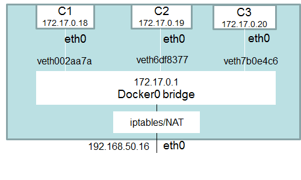

# Volúmenes

Una de las mas importantes funcionalidades de Docker son los volúmenes.

Estos no son mas que carpetas en nuestro sistema de archivos que son capaces de sobrevivir al ciclo de vida normal del contenedor. Los volúmenes suponen el modo en el que Docker permite persistir los datos de tu aplicación. Los aloja fuera del propio contenedor, en el propio sistema de archivos del host donde está corriendo Docker, de tal manera que se puede cambiar, apagar o borrar el contenedor sin que afecte a los datos.


Los volúmenes son bastante útiles porque permiten compartirse entre contenedores, o el propio host. Eso nos permite cosas como:

- Montar el código fuente de una aplicación web, dentro de un volumen, accesible desde el contenedor web y así ver en tiempo real los cambios durante el desarrollo.

- Consultar todos los logs cómodamente desde un contenedor dedicado.

- Hacer backups de un contenedor desde otro dedicado, o recuperar esos mismo backups hacia nuestro host.

- Compartir la misma información entre varios contenedores sin duplicarla. Por ejemplo la información relativa al entorno: desarrollo, integración, preproducción, producción.

De hecho, se pueden hacer contenedores con la única función de producir archivos (.tar.gz, .deb, …) en volúmenes que luego son consumidos por servicios de runtime, por ejemplo un servidor web, un repositorio o simplemente un NFS. Para ello hay que definir qué parte del contenedor se dedica a la aplicación y qué parte a los datos.

- Los volúmenes de datos están diseñados para conservar los datos, independientemente del ciclo de vida del contenedor.

- Docker, por lo tanto, `nunca elimina automáticamente` los volúmenes cuando se elimina un contenedor, ni tampoco “recoge basura”: volúmenes huerfanos a los que ya no hace referencia un contenedor.

- Los volúmenes son específicos de cada contenedor, es decir, que puedes crear n contenedores a partir de una misma imagen y definir volúmenes diferentes para cada uno de ellos:

- Los volúmenes también pueden usarse para compartir información entre contenedores.Montar el código fuente de una aplicación web, dentro de un volumen, accesible desde el contenedor web y así ver en tiempo real los cambios durante el desarrollo.

- Consultar todos los logs cómodamente desde un contenedor dedicado.

- Hacer backups de un contenedor desde otro dedicado, o recuperar esos mismo backups hacia nuestro host.

- Compartir la misma información entre varios contenedores sin duplicarla. Por ejemplo la información relativa al entorno: desarrollo, integración, preproducción, producción.

## Tipos de volúmenes

Los volúmenes pueden ser de 3 tipos distintos, y se categorizan según esta lista:

- `Data volumes`
    - Anonymous data volumes
    - Named data volumes
- `Mounted volumes`

## Data volumes (Volumes de docker)
### Anonymous data volumes
Se crean cuando se levanta un contenedor y no se le asigna un nombre concreto, mediante el comando docker run, por ejemplo:

```bash
docker run -ti --name alpine1 --rm -v /data alpine:3.4 sh
```


A su vez, otro contenedor puede montar los volúmenes de otro contenedor, ya sea porque los creó o porque los ha montado de un tercero.
```bash
docker run -ti --name alpine2 --rm --volumes-from alpine1 alpine:3.4 sh
```

### Named data volumes

Estos volúmenes no dependen de ningún contenedor concreto, y se pueden montar en cualquier contenedor. Se crean específicamente usando el comando docker volume create, o al ejecutar un contenedor si le damos un nombre en la línea de comandos.

```bash
docker volume create --name vol1
vol1
docker run -ti --rm -v vol2:/data alpine:3.4 true
docker volume ls
DRIVER              VOLUME NAME
local               vol1
local               vol2
```
Estos volúmenes no se eliminan por si solos nunca y persisten cuando su contenedor desaparece. Para eliminarlos se necesita una intervención manual mediante el comando docker volume rm.

## Mounted volumes  (Bind)

Otras veces nos interesa montar archivos o carpetas desde la máquina host. En este caso, podemos montar la carpeta o el archivo especificando la ruta completa desde la máquina host, y la ruta completa en el contenedor. Es posible también especificar si el volumen es de lectura y escritura (por defecto) o de sólo lectura.

```bash
$ docker run -ti --rm -v /etc/hostname:/root/parent_name:ro -v /opt/:/data alpine:3.4 sh
$ cat /root/parent_name
$ ls /data/
```

Este último caso es ideal para recuperar *backups* o ficheros generados en un contenedor, en vistas a su utilización futura por parte de otros contenedores o del mismo *host*.

# Tocando los volúmenes

Con los volumenes tenemos la manera sencilla y predefinida para almacenar todos los archivos (salvo unas pocas excepciones) de un contenedor, usará el espacio de nuestro equipo real y en “/var/lib/docker/volumes” creará una carpeta para cada contenedor.

Podemos crear un volúmen con un nombre especial (que pueda facilitar su gestión) o dejar que el propio Docker le asigne un “hash”.

Ahora creamos un volúmen llamado “mis_datos”.

```bash
docker volume create mis_datos
``` 

Veremos las propiedades de ese volúmen y donde está almacenado en nuestro equipo real “/var/lib/docker/volumes/mis_datos/_data”.

```bash
docker volume inspect my-vol
```

También podremos eliminar ese volúmen con la opción “rm”.
```bash
docker volume rm mis_datos
```
Hasta que no borremos los contenedores que usen ese volúmen, no podremos borrarlo.


Ejemplo de creación de un nuevo contenedor usando ese volúmen, asociándolo a la carpeta “/var/lib/mysql” del contenedor.

```bash
docker run -d -it --name ubu1 -v mis_datos:/var/lib/mysql ubuntu:17.10
# Otro ejemplo
docker run -d -v $(pwd)/data:/data awesome/app bootstrap.sh
```

También es posible usar una refencia relativa a la carpeta donde estémos parados al correr la creación del contenedor. (pwd)
```bash
docker run -d -it --name ubu2 -v "$(pwd)"/datos:/var/lib/mysql ubuntu:17.10
```

El comando inspect del contenedor nos dará mas información sobre la unidad montada. En este caso la carpeta “/tmp/datos” se montará como “/var/lib/mysql” en el contenedor. Indica que el acceso es R/W (lectura y escritura).

```bash
docker inspect ubu2
```
---

# Networking entre contenedores

Los contenedores envuelven una pieza de software en un sistema de archivos completo que contiene todo lo necesario para ejecutarse: código, tiempo de ejecución, herramientas del sistema, librerías, etc, cualquier cosa que se pueda instalar en un servidor. Esto garantiza que el software siempre se ejecutará igual, independientemente de su entorno. Por defecto, los contenedores aíslan las aplicaciones entre sí y de la infraestructura subyacente, al tiempo que proporcionan una capa adicional de protección para las aplicaciones.

Ahora ..¿qué sucede si las aplicaciones necesitan comunicarse entre sí, con el host o con una red externa? ¿Cómo se diseña una red para permitir una adecuada
conectividad manteniendo la portabilidad de las aplicaciones, el descubrimiento de servicios, el equilibrio de carga, la seguridad, el rendimiento y la escalabilidad? 

Es dónde entra en juego la **magia** del concepto de `networking` entre los contenedores

Para que los contenedores Docker se comuniquen entre sí y con el mundo exterior a través de la máquina host, debe haber una capa de red involucrada. Docker admite diferentes tipos de redes, cada una adecuada para ciertos casos de uso.

Docker ya viene con drivers de red orientados a diferentes casos de uso. 

## ¿Qué es docker0 en términos de Docker Networking?

Cuando se instala Docker, se crea una red de puente predeterminada denominada `docker0`. Cada nuevo contenedor de Docker se adjunta automáticamente a este
red, a menos que se especifique una red personalizada.

Además de docker0, Docker crea automáticamente otras dos redes: `host` (sin aislamiento entre el host y los contenedores en esta red, al menos mundo exterior están en la misma red) y `none` (los contenedores adjuntos se ejecutan en la pila de red específica del contenedor)





## Redes predeterminadas en Docker

`docker network ls` 

- **Bridge**: La  red  bridge  representa  a  la  red  docker0  que  existe  en  todas  las instalaciones  de  Docker.  A  menos  que  use  docker  run -net=opción,  el daemon  de  Docker  conectará  el  contenedor  a  esta  red  de  forma predeterminada.  Usando  el  comando ifconfig en  el  host,  puede  verse  que este Bridge es parte de la pila de red del host.

    ```bash
    docker run -d -P --net=bridge nginx:1.9.1
    #Inpeccionar la red bridge: `# docker network inspect bridge`
    ```
    
- **None**: La  red  agrega  un  contenedor  a  una  pila  de  red  específica  del contenedor sin conectarlo a ningún interfaz de red.  $ Docker network inspect none

    ```bash
    $ docker run -d -P --net=none  nginx:1.9.1
    $ docker ps
    $ docker inspect <ID:docker> | grep IPAddress
    ```


- **Host**: La  red  agrega  un  contenedor  a  la  pila  de  red  del  host.  Se  puede comprobar que la configuración de red en el contenedor es la misma que el host.

    ```bash
    $ docker run -d --net=host ubuntu:14.04 tail -f /dev/null
    $ ip addr | grep -A 2 eth0:
    $ docker ps
    $ docker exec -it <id:docker> ip addr

    ```
   
    Para inspeccionar la red host: `# docker network inspect host`
    
- **Overlay**:  Para el tipo overlay, necesitas trabajar en modo clúster. Si intentas crear una red de este tipo, sin estar en este modo, obtendrás el siguiente mensaje:

    ```bash
    $ docker network create --driver overlay multihost-net
    Error response from daemon: This node is not a swarm manager. Use "docker swarm init" or "docker swarm join" to connect this node to swarm and try again
    ```

- **Macvlan**: Existe un cuarto modo llamado macvlan que nos permite asignar IPs de una red a cada uno de los contenedores que viven en nuestro host. Sin embargo, para que este tipo de redes funcione necesitamos que la tarjeta de red del host esté en modo promiscuo, lo cual significa que necesita estar a la escucha de todos los paquetes que viajan por dicha red, simplemente para poder reconocer aquellos que potencialmente pueden ser para uno de sus contendores. Este modo muchas veces no está permitido en muchas organizaciones. La forma de configurar una red de este tipo sería así:

    ```bash
    $ docker network create -d macvlan \
    --subnet=172.16.86.0/24 \
    --gateway=172.16.86.1 \
    -o parent=eth0 \
    my-macvlan-net
    ```

## Comandos de red docker

Opciones del comando

```bash
docker network --help
```

    
Crear una red de prueba de red

```bash
docker network create network-test
```

```bash
docker network inspect test-network
```


Iniciamos un  contenedor y lo conectamos a nuestra rede de pruebas

```bash
docker run -itd --name=test1 --net=network-test busybox
```

Crearemos una red nueva, que se podrá usar para aislar ciertos contenedores, en este caso será la 172.19.0.xx

```bash
docker network create --driver bridge mi_re docker network create --driver bridge mi_red
```

A partir de crear nuevas redes, las podemos utilizar en contenedores, si arrancamos dos contenedores indicando que usen esa red con “–network xxx” ambos obtendrán un IP de ese rango (172.19.0.2 y 3) y se verán entre si.

```bash
docker run -d -P --name Contenedor_Nombre --network mi_red imagen_uno
```

#### Por ejemplo:
Correremos dos contenedores en la misma red standard ( bridge ).

```bash
docker container run --name ubuntu1 ubuntu
docker container run --name ubuntu2 ubuntu
```

Ahora conectaremos ambos contenedores a otra red creada manualmente (test), estaran conectada a la red default y a la red test.

```bash
docker network connect test ubuntu1
docker network connect test ubuntu2
```

Podemos desconectar esos contendores de la red:
```bash
$ docker network disconnect test ubuntu1
$ docker network disconnect test ubuntu2
```

También podemos borrar esa nueva red.

```bash
$ docker network rm mi_red
```


## Linkear contenedores

Cuando se crea un nodo de contenedores es necesario que esos contenedores puedan conectarse entre sí por IP o por nombre de host. Pero como ya se dijo, si un contenedor se apaga al iniciarse nuevamente se generan nuevos parámetros como el ID y la IP que utiliza.

Para poder salvar este problema, existe la funcionalidad de «*linkear*«, enlazar, uno o más contenedores que permitirá que cada vez que uno de los contenedores enlazados se apague y se encienda, no importe la IP que el motor docker le asigne ya que se conectarán por el nombre de contenedor. Toda la magia necesaria la realiza el motor docker, como por ejemplo las reglas de ruteo, las reglas dns, etc.

Para poder enlazar contenedores se debe utilizar la variable «–link» al crear un contenedor con el comando 

`docker run -itd --link ID/contenedor01 --name contenedor01 -h contenedor02 ubuntu`


---

 # Día 3 - Docker Lab 

## Tocando los volúmenes

Vamos a trabajar con el siguiente Dockerfile [Dockerfile](/extras/02-imagenes/v0.1.0/Dockerfile)


```bash
╰─ docker build -t docker-eati:latest ../extras/01-contenedores
DEPRECATED: The legacy builder is deprecated and will be removed in a future release.
Install the buildx component to build images with BuildKit:
https://docs.docker.com/go/buildx/

Sending build context to Docker daemon  3.584kB
Step 1/2 : FROM php:7.2-apache
7.2-apache: Pulling from library/php
6ec7b7d162b2: Pull complete 
db606474d60c: Pull complete 
afb30f0cd8e0: Pull complete 
3bb2e8051594: Pull complete 
4c761b44e2cc: Pull complete 
c2199db96575: Pull complete 
1b9a9381eea8: Pull complete 
fd07bbc59d34: Pull complete 
72b73ab27698: Pull complete 
983308f4f0d6: Pull complete 
6c13f026e6da: Pull complete 
e5e6cd163689: Pull complete 
5c5516e56582: Pull complete 
154729f6ba86: Pull complete 
Digest: sha256:4dc0f0115acf8c2f0df69295ae822e49f5ad5fe849725847f15aa0e5802b55f8
Status: Downloaded newer image for php:7.2-apache
 ---> c61d277263e1
Step 2/2 : COPY src/ /var/www/html/
 ---> 5d361828995b
Successfully built 5d361828995b
Successfully tagged php72appache:latest
```

Luevo ejecutamos la imagen creada: :

```bash
╰─ docker run -ti -d php72appache
8753c34789b6b347d8145b602a85de05b2dddc0f3fb225db89db551c15a53f0a
```

Vemos si se encuentra el archivo index.php dentro del contenedor (puede ser mediante dos opciones: accediendo al contenedor ó mirando lo que tiene ese contenedor en ese path)


```bash
╰─ docker ps
CONTAINER ID   IMAGE          COMMAND                  CREATED         STATUS         PORTS     NAMES
8753c34789b6   php72appache   "docker-php-entrypoi…"   8 minutes ago   Up 8 minutes   80/tcp    heuristic_lewin


╰─   docker exec -ti 8753c34789b6  /bin/bash
root@8753c34789b6:/var/www/html# cat index.php 
<?php
  echo "Hola EATI 2024 desde PHP7!"
?>

╰─  docker exec 8753c34789b6 ls /var/www/html/
index.php
```

Ahora, ¿qué sucede si quiero cambiar el contenido de ese archivo y más tarde eliminar el contenedor?

```bash
╰─ docker rm 8753c34789b6 
```

Ahora vuelvo a ejecutar la imagen anteriormente creada de php72apache

```bash
╰─ docker run -ti -d php72appache
588d39be05c22e43441ed3fefd18e0d6b4d2e1fb482b0794791abd70e12ba949

╰─ docker ps
CONTAINER ID   IMAGE          COMMAND                  CREATED         STATUS         PORTS     NAMES
588d39be05c2   php72appache   "docker-php-entrypoi…"   3 seconds ago   Up 2 seconds   80/tcp    laughing_galileo


╰─ docker exec 588d39be05c2 cat /var/www/html/index.php
<?php
  echo "Hola EATI 2024 desde PHP7!"
?>
``` 

El archivo modificado mantuvo los datos? 
Esa es una de las razones por la de utilizar volumenes en Docker.

Dar un ejemplo de database !!!
Para eso ver ejemplo en extra [Volumen_database](/extras/03-vol-redes/v0.1/Readme.md)
