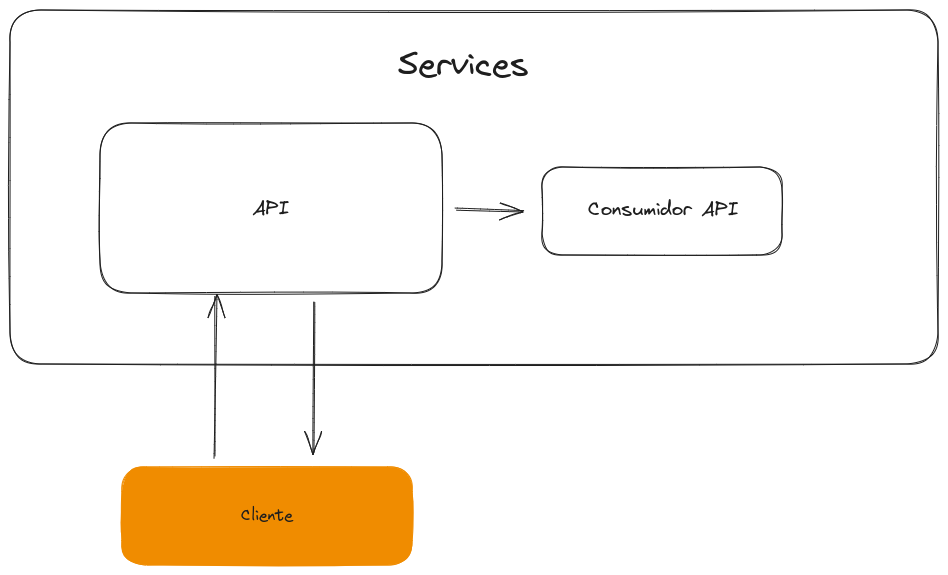
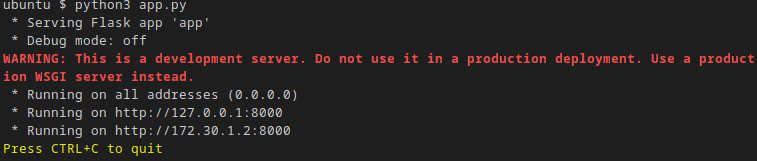
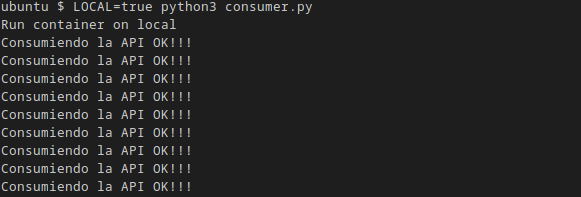
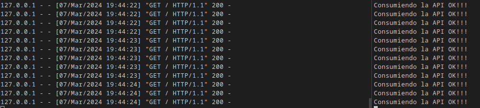

# Proyecto integrador
---

## Dockerizar una aplicación Flask y un consumidor

Esto es un proyecto de una API básica de flask y con un consumidor de la API (consulta si la API está viva) .

Lenguaje: Python
Version: >3.8

### Arquitectura



```bash
src
├── app
│   ├── app.py
│   └── requirements.txt
│   └── templates
│       └── index.html
└── consumer
    └── requirements.txt    
    └── consumer.py
```

El trabajo consiste en `dockerizar` la app y el consumidor (creación de un archivo Dockerfile para ambos) y poder comunicarlos. Si la comunicación es exitosa, implementar un `docker-compose.yml` 

Para el consumidor es necesario las variables:
```bash
LOCAL = true
PYTHONUNBUFFERED = "1"
```


- Print de pantalla con los resultados.
- Dockerfile API y Consumer
- Docker-compose.yml


---
### Resolución

- Probar la aplicación y el consumidor de python "SIN DOCKER" y lograr que primeramente funcione en su entorno de trabajo (Windows, Linux)


1. Ir a src/app y ejecutar la app (servicio 1)

```bash
python3 app.py
```



2. Ir a src/consumer, ejecutar el consumer (servicio 2) 

```bash
LOCAL=true PYTHONUNBUFFERED="1" python3 consumer.py
```


3. Deberían ver las dos terminales juntas 



- Resolver el miniproyecto anterior ya funcionando pero ahora utilizando DOCKER y DOCKER-COMPOSE

### Tiempo aproximado: 1hs

#### Ayuda: Intente completar los siguientes Dockerfiles

```Dockerfile app
#Replicar mi entorno de trabajo dentro de la imagen
#Base python3.8
FROM python:3.8
#Crear directorio /app
RUN mkdir /app
#Crear directorio /app/templates
RUN mkdir /app/templates
#Pararme en el directorio de trabajo /app
WORKDIR 
#Agregar el archivo requeriments.txt dentro de la carpeta /app 
ADD requeriments.txt /app
#Agregar el archivo app.py dentro de la carpeta /app
ADD 
#Agregar el archivo templates dentro de la carpeta /app/templates
ADD 
# Instalar los modulos que necesita mi aplicación
RUN pip install -r requeriments.txt
# Ejecutar el binario "python3" con el argumento "app.py" cuando comience a correr el contendor
CMD ["python3", "app.py"]
```

```Dockerfile consumer
#Replicar mi entorno de trabajo dentro de la imagen 
#Base python3.8
FROM 
#Crear directorio /consumer
RUN 
#Pararme en el directorio de trabajo /consumer
WORKDIR /consumer
#Agregar las variables de entorno a mi imagen
ENV LOCAL=true
ENV PYTHONUNBUFFERED=1
#Agregar el archivo requeriments.txt dentro de la carpeta /consumer
ADD 
#Agregar el archivo consumer.py dentro de la carpeta /consumer
ADD 
# Instalar los modulos que necesita mi consumidor
RUN pip install -r requirements.txt
# Ejecutar el binario "python3" con el argumento "consumer.py" cuando comience a correr el contendor
CMD ["", ""]     
```

#### Build de contenedores
```bash
#Ubicarse dentro de la carpeta /app
docker build -t myapp .
```

```bash
#Ubicarse dentro de la carpeta /consumer
docker build -t myconsumer .
```

#### Poner en ejecución el contenedor myapp
```bash
#Ubicarse dentro de la carpeta /app
docker run --name myapp  -p 8000:8000 myapp 
```
#### En otra terminal, poner en ejecución el contenedor myconsumer
```bash
#Ubicarse dentro de la carpeta /app
docker run --name myconsumer  myconsumer
```

¿Se estableció la comunicación? ¿Qué paso? Analizar


Complete el siguiente `docker-compose.yml` y guardelo dentro de la carpeta /src

```docker-compose.yml 

services:
  api:
   build: ./app
   
  consumer:
   build: ./consumer
    
```

Después de completar el `docker-compose.yml` ejecute el siguiente comando:

```bash
docker-compose up
```

Debería ver algo de está forma:

